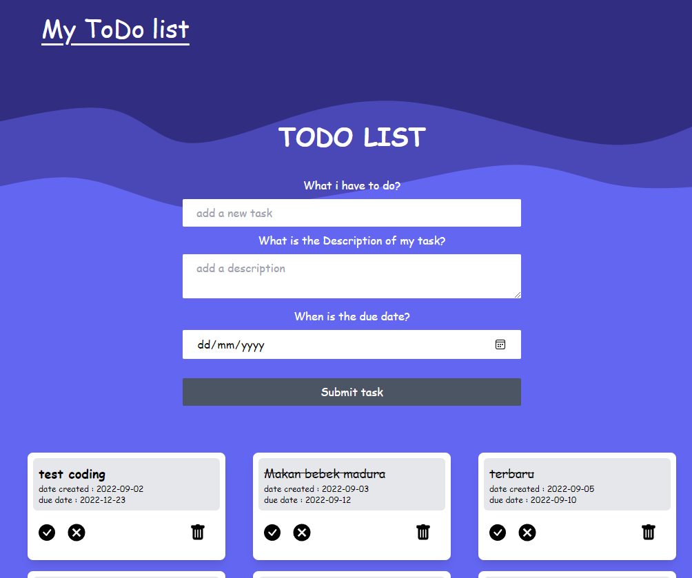

# Todo-list-app

## Table of contents

- [About](#about)
- [Features](#features)
- [Live Demo](#live-demo)
- [Built with](#built-with)
- [Getting started](#getting-started)
  - [Installation instructions](#installation-instructions)
- [Author](#author)
- [Show your support](#show-your-support)

---

## About

A todo app where the user can Add/Edit/Delete todos. Todos are saved online to the todoist.com api, the user can access his lists and tasks anytime using my todoist account.



## Features

The features of this project are, user can:

1. Create a task.
2. Add description to each task.
3. Add due date.
4. Mark task as complete / incomplete.
5. Delete and edit tasks.

## Live Demo

This project is hosted on github pages.

[Live demo link](https://todolist-blue.netlify.app/)

## Built With
 
<div> 
   <a href="https://www.w3.org/html/" target="_blank" rel="noreferrer"> 
     
  </a>
   <a href="https://www.w3schools.com/css/" target="_blank" rel="noreferrer"> 
     
  </a> 
  <a href="https://developer.mozilla.org/en-US/docs/Web/JavaScript" target="_blank" rel="noreferrer"> 
     
  </a>
  <a href="https://reactjs.org/" target="_blank" rel="noreferrer"> 
     
  </a>
  <a href="https://tailwindcss.com/" target="_blank" rel="noreferrer"> 
     
  </a>
</div>


## Getting Started

### Installation instructions

Follow along the steps below to get a copy at your local machine.

- Navigate to the directory where you want this project to clone and then clone it

  ```
  git clone git@github.com:lutfianwr/todolist.git
  
  ```
- Navigate to the `todolist` directory

  ```
  cd todolist
  ```

- Install the npm package with `npm install`
- Start the server with `npm run start`
- The site should automatically open in your browser at http://localhost:3000/ if it didn't then open your browser with that link.

## Author

😎 **Lutfi NA**

- GitHub: [@lutfianwr](https://github.com/lutfianwr)
- Linkedin: [Lutfi Nuril Anwar](https://www.linkedin.com/in/lutfinurilanwar/)

## 🤝 Contributing

Contributions, issues, and feature requests are welcome!

## Show your support

Give a ⭐️ if you like this project!
